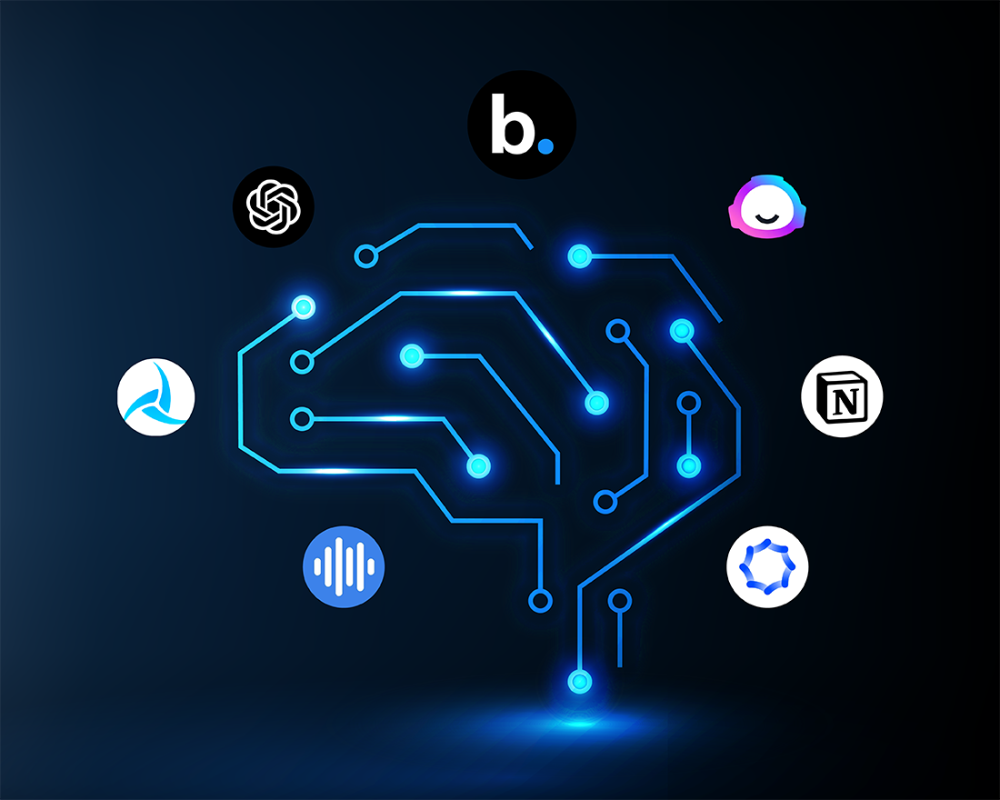

# Using AI as an Educational Tool

## AI meets Education

When I first came to my ICS 314 class, I remember our professor briefly talking to us about the use of AI when it came to any assignments or WODs. Some tools he mentioned weree ChatGPT and GitHub Copilot. I knew what ChatGPT was since it was a very well known AI tool used by a lot of people. On the other hand, GitHub Copilot was new to me and that was the first time I had heard of it. It came as a surprise when I heard my professor tell us that it was okay to use AI for the class so long as we said we did, which I think is fair. When it comes to AI and its role in education, it can be a bit controvesial. Some may argue that students will depend on AI to do their work and cheat the system, and some may argue that AI can help students learn and help them with assignments by giving them ideas on how to approach it. In software engineering, I believe AI can help students with understanding how certain lines of code work, and possibly give students inspiration on how to approach an assignment. Programmers often communicate with other programmers, or seek help on the Internet, to see what tactics were useful for them, helping them to have a better understanding with how to approach a problem. I believe it's the same when it comes to AI. For this class, I have used ChatGPT and Copilot to help me with assignments and gain a better understanding on how certain code works.

## My Experience with AI

Reflecting on my personal experience with using AI, I'd say that overall, I had a great experience using AI in ICS 314. There were times when using AI helped me to further progress into my work, and there were times when AI wasn't as helpful. Below are some of my experiences with AI in various course elements:

### 1. Experience WODs

I have definitely used AI in a lot of the experience WODs in this class. My main use for AI was to help me understand how to approach the WODs. For example, for E30 and E31 in the unit of HTML/CSS, whenever I needed to figure out how to code some sort of CSS property but didn't know exactly which one to use, I used ChatGPT to help me figure that out. I found this to be a useful, pleasant experience because I was able to make progress on my WOD and also learned why the chosen CSS property was the one I needed to use. On the other hand, some not-so-good experiences I had when using AI for experience WODs was for E41-E43. These WODs required us to install some applications, such as pgAdmin and PostgreSQL, to our laptops that we were going to use for the rest of the semester. I struggled a bit to install these applications as I was not sure about if I was doing it correctly. I figured to use AI, such as ChatGPT, to help me by providing steps on how to properly install these applications. For these experiences, I did use the provided videos/tutorials to help, but at times, I got confused, so that's where I used AI to help me. Sometimes, using AI was helpful, but usually, it wasn't. It wasn't helpful sometimes because the steps it would provide me either didn't work, or it would totally mess everything up and I would start the installing process all over again. For example, when setting up PostgreSQL, originally, we were given a link to a guide for setting up PostgreSQL, but I used ChatGPT because I didn't want to read everything and I just wanted a simple step-by-step description. At one point while setting up, I needed to create a postgres account or something so I could use the application. This turned out to be not helpful because I would do as ChatGPT says, but then when I try to move on, there was a problem. I would then send my problem to ChatGPT, but then it would get worse, which ultimately ended up with me just starting over and setting it up again. 

### 2. In-class Practice WODs

For in-class practice WODs, I usually tried to do the WODs on my own because I thought it was important that I still try to work on my own without the help of AI. The only times I did use AI was to check what's wrong with my code and fixing it, or if I wasn't too sure how to implement something. For example, for any practice WODs that were based off of bootstrap, such as building Murphys using boostrap, I would use the AI to help me center the Murphys logo because I wasn't too sure how to properly do it, or sometimes the logo wasn't centered properly. For this, I asked ChatGPT "My logo still isn't centered at the top. How do I fix this?" Using ChatGPT helped me to have an idea on how to fix it by providing me code with comments that tell me that certain properties will adjust the position the logo was in. However, the result I got sometimes still wasn't good enough so it took up a lot of time and a lot of trial and error before I was able to get the result I wanted. 

### 3. In-class WODs

For a lot of the in-class WODs, I did use ChatGPT and GitHub Copilot to help me. I used these tools to help me get a start with my code and also fixing any lines of code. For example, for the Typescript 3 WOD, I wasn't too sure how to approach certain steps in the instructions, so I would copy and paste those instructions into ChatGPT and it provided me some code that would do as the prompt says. I made my code based off of what ChatGPT provided and I was able to get my code to work and finish the WOD within the time limit. Using AI was helpful in this situation because I was able to complete the WOD within the time we were given, meaning that I would get full credit for it. This is a more positive example on how AI helped me with an in-class WOD, but I have had some instances where AI didn't help me. An example of this would be when we were working on WOD: UI Design (React). For this WOD, we needed to recreate a page based on the Aloha Beer website using react. I used AI in this WOD to help me figure out how to properly position certain things, such as logos and text, and also applying the correct colors to certain things. One thing that I struggled in particular was getting one word in a text to be yellow. I used ChatGPT and asked it "I need (word) in this text, (text), to be yellow. How do I do this?" The results given at first didn't work, but after a bit, I was able to get it to work, but then came another problem, which was properly positioning the text. Using AI here helped with making some progress in the WOD, but ultimately ended up with me not finishing the WOD and receiving a zero for it. This was the result because ChatGPT was unable to provide me the necessary results I needed, therefore, it costed me a lot of time in the WOD. A benefit for using AI in these WODs are that it helps me to make progress and hopefully finish the WOD before time is up, but at the same time, if the results I get from the AI do not give me the needed results, then it will cost some time and may make me end up not finishing the WOD on time.

### 4. Essays

When it came to writing technical essays, I didn't use ChatGPT too much because the writing style of these essays are a little more "relaxed" compared to writing essays for other classes. This is because our essays are meant to kind of sound like "blogs", or not as serious as academic essays. Because I have a little more freedom with writing, the essays I write for this class are all written by me. The only times I did use ChatGPT was when coming up with essay names because I'm not too good with coming up with good essay names. While we do have some freedom with these essays, obviously, it would be boring to name an essay as "______ Essay" or "Essay on _______". Like academic essays, it was still important that we come up with good titles that would "catch the reader's attention". Since I didn't really have the brain power and creativeness to think of my own essay title, I used ChatGPT to help me come up with some ideas. For instance, in the beginning of the semester, we were tasked to write a technical essay on Typescript. Of course, we couldn't just name the essay "Typescript Essay" because that's just boring. I used ChatGPT to help me by asking it "I need to write an essay on Typescript. What are some potential title names that I could use for my essay?" ChatGPT provided me some title ideas and I tried to make my own based on the given ones, which resulted in me coming up with the title "Exploring Typescript: A Newcomer's Perspective". Using ChatGPT to come up with an essay title was helpful because it allowed me to not spend so much time sitting and thinking what to name my essay. Without AI, I probably would've taken a very long time just thinking of a title when that time could be spent actually writing the essay.

### 5. Final Project

GitHub Copilot helped me a lot with working on the final project. I used these tools for various reasons, such as fixing any UI related things/applying bootstrap and/or CSS, and helping me write lines of code that I was not too sure about. For example, one of my issues was creating a search bar so users can search up a specific club. I used GitHub Copilot to help me by asking it "How do I implement a search bar into this application?" It provided me useful code that I then implemented into the code. Then, I added on a few minor things to it, such as a magnifying glass icon to indicate that it was a search bar. Using Copilot was helpful because it helped me to write code faster and to make my visions and ideas become reality. 

### 6. Learning a concept/tutorial

When learning new concepts or going through tutorials, I try my best to not use any AI to help me because I want to try to learn it on my own first. If I find that I'm struggling and need a little more help, then I will resort to using AI to help me. For example, when going through the Typescript tutorial, it was quite difficult because Typescript was very new to me. Whenever I got stuck on a prompt, I was ask ChatGPT how to implement code based on the instructions and go from there. This helped me because it helped me learn how to approach the problem the next time I encounter it.

### 7. Answering a question in class or in Discord

I have never had to answer any questions in class or on Discord, but if I did, I would imagine that I wouldn't use ChatGPT because I feel like the answer should come from me. By answering it myself, it shows me how much I understand something because of how I can explain it to someone else. 

### 8. Asking or answering a smart-question

Similar to the previous element, I haven't answered or asked any smart questions, but if I did, I still wouldn't use ChatGPT or any AI tools because I don't think using AI would be necessary in this situation. I am a person and I am capable of coming up and asking my own questions, or answering them, so I don't really need AI to do it for me.

### 9. Coding example

I haven't used AI for this element because I never really thought or needed to see any coding examples. However, it wouldn't be a bad idea to use AI because I think AI would help me better understand how code for various scnearios.

### 10. Explaining code

While I don't usually need code to be explained to me, there are some rare instances where I do want to know why certain code works the way it does, so I do use AI for this situation. For this course in particular, however, I didn't use AI for this purpose because I never really needed to have any code explained to me. 

### 11. Writing code

I've used ChatGPT and Copilot to help me write code, especially Copilot. When we were first working on Typescript, sometimes the code I wrote wasn't working so I would take my code and put into ChatGPT, and then ask the AI to fix and write things went wrong in my code. I also used Copilot for the same reason, but to also write code that I wasn't too sure about writing. For example, in the final project, I gave myself the task of creating a search bar, but didn't really know how to properly implement it, so I asked Copilot to write the code for me. This was helpful because it saved me a lot of time on my issue. 

### 12. Documenting code

Documenting code is when you write a description or comment on certain lines of code, such as its purpose. When writing these comments, I usually write them myself and not with AI because I think a brief comment should be good enough. I usually keep my comments as short as I can, but short enough so I can still understand what the code is doing. I don't use AI for this because I think it'll be faster if I made my own comments. However, if my code comes from AI, then usually the comments it provides should be there as it is.

### 13. Quality Assurance

A lot of times, I have used Copilot to help me with quality assurance. For example, when working on the final project, I worked on the design of our website and used Copilot a lot. Sometimes, I would have trouble getting something properly positioned on the page, so I would ask Copilot "What's wrong with my code and how do I make it so that it does (issue)?" Usually, the result I would get wouldn't be the result I want, but after a bit, I eventually get what I need. Using Copilot was helpful in making progress, but it take a lot of time just to fix the quality of the application.

### 14. Other uses in ICS 314

Thinking back on my use of AI in ICS 314, I don't think there are any other instances that I haven't already touched upon because all the previous elements are the main things I decided to use AI for.

## AI's Impact on Learning and Understanding

Using AI has influenced my learning experience by providing me an explanation on certain topics in a way that I could understand. A lot of times whenever I don't understand something, I will ask ChatGPT to explain it to me in a more simpler way, which very much helps me to understand what is being taught to me. This helps me with comprehension, skill-development, and problem-solving abilities because now that AI has helped me to have a better understanding on things, I can easily apply what I have learned to future projects and assignments. Using AI technologies to understand software engineering concepts has enchanced my understanding because it provides me explanations in ways that I could understand it if learning it from an actual person was confusing.

## The Practical Applications of AI

With the evolution of technology, AI has started to become more prominent. Some applications of AI that I have seen outside of ICS 314 is for artistic creation. I've seen a lot of art made by AI on social media and Internet. While most of the AI produced art looks good, there is some controversy with it as some believe it takes away from art made by actual people. I also think it depends on what prompt is given to AI and the type of art being produced, whether it's a picture/image, or a short video. When it comes to images, the outcome produced by AI may be more effective, but when it comes to producing videos, it's a little questionable in terms of quality. For example, on Instagram, I've seen videos that are based on real images in attempts to make those images like videos, but sometimes, the AI causes the people and objects to become deformed or changed. An example of this is when there was an image of two people hugging, but the one of the person's arms fazes through the other person's arm. I've also seen AI being used for simulations, such as Charcter AI's. Character AI's are made from characters from different medias, such as movies, TV shows, etc. AI is used by providing these characters the ability to communicate with users while also sounding/acting like the character actually would in their respective shows/medias. There are simulations where you can act like you are texting that character, or you could even "call" them. There are some applications where you can call a certain person/character, but in reality, it's just an AI that you would be talking to. 
The AI applications mentioned above demonstrate the potential of AI to enhance creativity and simulate user interactions. However, their effectiveness in addressing real-world software engineering challenges is mixed. While they excel in automating tasks and providing innovative solutions, they often require human oversight to address inaccuracies, such as deformities in AI-generated videos or maintaining context in character simulations. This highlights that AI is a valuable tool but not yet a complete substitute for human expertise.

## AI's Challenges and Opportunities

I think some challenges that came when using AI was that sometimes, code that has been produced by AI wouldn't provide me the results that I'm looking for. For example, whenever I wanted to fix something UI or CSS related, I would use ChatGPT to help me by sending it the code I have and telling it to fix it based on what I want. The code it provides me sometimes doesn't work, so I have to keep sending in questions to the AI until something happens. Another example is when lines of code would have red lines so I would use GitHub Copilot to help me fix it. A common solution Copilot would give me is to delete that line of code with red, but I know this isn't the right fix because that line of code is important. This happened a lot while working on the final project. 

Despite the challenges that come to using AI, I think there are still potential opportunities to integrate AI into education in software engineering. I think AI can be used to help students gain a better understanding on certain software engineering concepts if the option to ask someone else for help isn't available. For example, maybe a student is working on an assignment or project late at night, but is in dire need of an explanation or help with code. There could be a specific AI application made specifically for software engineering education that is ready for use at any time of the day.

## Comparative Analysis on AI

While AI does have its benefits and be helpful with software engineering education, compared to traditional teaching, I believe traditional teaching is overall better than AI. In terms of engagement, traditional teaching is better. To me, something about human interaction is a lot more engaging than interacting with AI. With a person, they can teach you not only by explaining concepts in the way they understand it, but you can also learn from any experiences that they share. Traditional teaching is also good with knowledge retention because you often retain information by practicing it, and you would practice it by doing homework. I don't think you could really do the same with AI because if you ask if to help you practice, it might just give you one question and you'll have to keep asking for more practice each time. With traditional teaching, teachers would also provide exams so you can apply your knowledge to test how well you understand things. With AI, there may be a chance AI might not create a set of questions that'll effectively test your skill development.

## Future Considerations on AI

I think as AI continues to evolve and is incorporated in more things, it'll become more effective and better enchance our experiences both outside of software engineering and in software engineering. I'd like to hope that AI will provide better responses when prompted to help with code. That is something that could be improved on. I also think for AI such as Copilot, there should be a feature where if a prompt sent in by a user does have more than one solution, then all the solutions should be sent out. For Copilot, when you use the quick fix feature, it often just does one way of trying to fix something, but the way it fixes your problem may not be the right fix. I believe one main challenge that comes with using AI in education is that students might take advantage of these AI tools by taking code made from AI and using it as their own. I think fixed by having some sort of AI detenction tool on hand or making a feature where AI rejects a user's question if it were to believe that the user is going to take its response and take it as their own.

## Conclusion on AI - Summarize your reflections and insights regarding the use of AI in the Software Engineering course. Conclude with any recommendations or suggestions for optimizing the integration of AI in future courses.

Using AI in the Software Engineering course has had its ups and downs and has provided me enhancements and challenges. For me, using AI was really helpful, but I think if the course was up to date with the materials, readings, and screencasts, then I wouldn't have to use ChatGPT or other AI tools as much as I did. It's okay to have AI help with learning, but I think to some extent, the information being taught should be coming from a person, such as the professors or anyone teaching the software engineering course. Depending on what you ask AI, it may take just a minute, or maybe 15 or more minutes to find a solution. 

AI was a very helpful tool for me in this course. It helped me to fix lines of code that wasn't working and properly implementing lines of code in WODs and projects. While this was great, I was using it with a risk of time. While some AI responses were helpful and gave me the necessary results I wanted, whenever that wasn't the case, then it would cost time. This wasn't good especially when it came to WODs since they are timed. When students considering using AI for this course, they should make sure they are aware of this so they can be finished with the work faster. 

On the subject of using AI for education, it's not necessarily a problem unless the students use the AI to do all the work for them. It's okay to use AI to help give you a start and give you some sort of idea on how to approach a problem, but students shouldn't solely depend on AI to do the work for them because they aren't learning anything if they do that. In order to effectively integrate AI into future courses, I think teachers should encourage students using AI to help them if needed while also emphasizing the importance of taking responsibility to learn and do work on their own.

