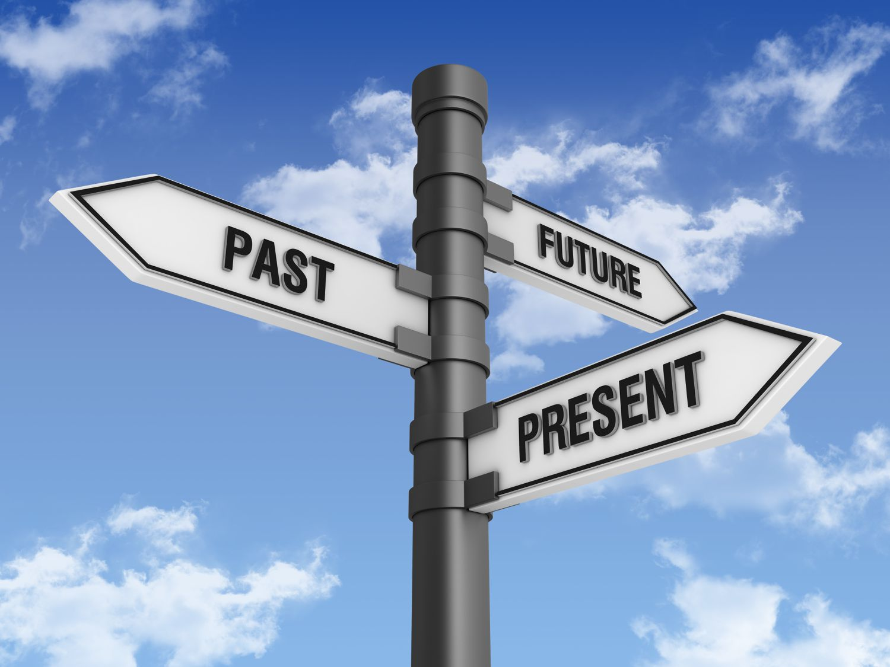

# The Past, The Present, The Future

## The Past

Ever since I was young, I knew I wanted to pursue a career within the field of technology, but wasn't exactly sure what I wanted to do. During a small tour of my high school when I was in 8th grade, I remember being brought to one of the classrooms on campus with some of my other classmates and our tour guide telling us, "This is the coding classroom." The word "coding" rang in my head. I knew this was an opportunity for me to get a taste of working with technology. 

Fast forward a few years later during my junior year of high school when we all were stuck in our homes during the pandemic, once I had room in my schedule to fit other electives, that was when I took the chance of registering for coding. At the moment, the class itself was called "Career Pathway: Information Technology" rather than just "coding". As we progressed through the school year, my classmates and I were able to learn a couple of languages, such as HTML/CSS and python. One of the things I remember from this class was creating a website using HTML and CSS. Because this was my first time coding, my final product wasn't that good; however, I was still proud and amazed by what I made. I knew from that moment that I wanted continue my new journey with coding. I continued to take coding in my senior year where we then learned how to use JavaScript. One of the memorable projects we did for this class was creating our own video game. At the end of the year, once we finish our games, my teacher told us he'd allow us to try out all the different games that were made. Sadly, because I was a senior, I never had the opportunity to try everyone else's games nor did I finish my own because the end of the school year was earlier for seniors. It was a difficult project, but very fun.

## The Present

As of now, I am currently a junior attending the University of Hawaii at Manoa majoring in a B.S. in Computer Science. Although I currently have no clue what specifically I want to do, I'm thinking of pursuing a career either in cybersecurity or software engineering. So far, my experience at UH Manoa has been interesting. As I continue to progress through the school year and get closer to graduating, I'm hoping to learn more about the different pathways computer science has to offer and hopefully figure out which one is best for me. 

## The Future

While I am unsure of what I will do in the future, let alone what the future holds for me, the only things I can really do is just do what I need to do and take advantage of any opportunities that come my way. I will continue to use my time to not only make my skills in coding better, but to research any potential pathways to follow once I graduate from college. To achieve this, I must stay motivated to and take things one step at a time.
