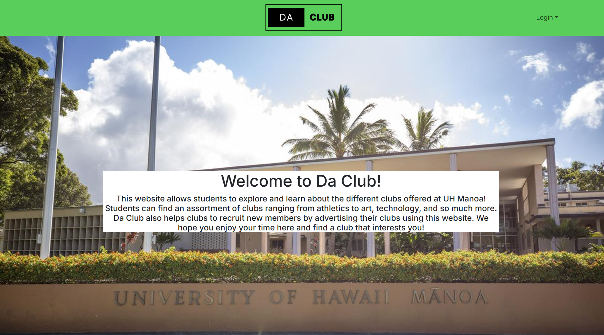
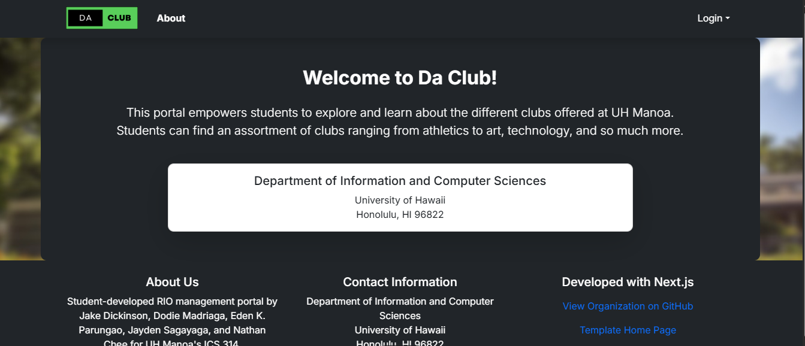

## Working on Da Club

For the final project of my ICS 314 course, students were put into teams and assigned specific website prompts. For my team, we were assigned "Club Hub", which was an application that served as a club catalog that students could use to look at different clubs on campus. Because we were told that we couldn't use the original project name "Club Hub", my team and I came up with "Da Club". 

During the first milestone of the project, my team and I focused on making the "structure" of the website that would eventually be improved on as time went on. We focused on some very basic issues, such as creating a simple design/layout for the page, creating a working schema for the application, and simple features such as signing in, signing up, and signing out. Although it was quite a rough start, we reflected on our experience during this first milestone and talked about how we could better improve for the next milestone.

While working on Milestone 2, we made a lot more progress and added a lot more to the application. We added some more functions/features to the application, made changes to our schema, etc. Overall, there was significant improvement made to the application and we were proud, but there was still a lot of work to be done for the third and final milestone.

Milestone 3 required us to make major improvements to our application than the previous milestones. With that, not only did we make big changes to our schemas and databases, but also to the design/layout of our page. Below are images of the original design from when we first started working on Da Club and the final product design:

We were also required to input real data into our application, so we added real clubs from UH Manoa to the database. We did this by looking at a Google spreadsheet of RIO's (Registered Independent Organizations) that contained information on every club there is at UH Manoa. We took about 100 clubs from this spreadsheet and incorporated them into our database.

To look at our final product of our application, Da Club, click <a href="https://daclub-ruddy.vercel.app/">here</a>.
