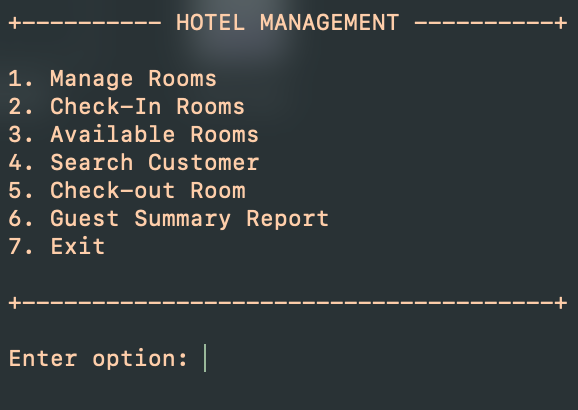

## Hotel Management System Project

In ICS 212 of Fall 2023, as our final project/exam, students were tasked to create a hotel management system in teams of five and had to present our final product during finals week. As a team, we broke up the project into parts for each member to work on. 

Our hotel management system needed to have six features:

<ol>
  <li>Manage rooms</li>
  <li>Check-in rooms</li>
  <li>Available rooms</li>
  <li>Search Customer</li>
  <li>Check-out rooms</li>
  <li>Guest Summary Report</li>
</ol>

Depending on what feature a user wants to use, they had to input one of the number options in order to use our application. For example, if a user wanted to check into a room, they would have to enter "2".

## Manage rooms

This feature allowed users to add, search, or delete rooms.

## Check-in rooms

Users were allowed to check into a room using this feature. The user would also be prompted to enter the following:

<ul>
  <li>Room number</li>
  <li>Booking ID</li>
  <li>Customer name</li>
  <li>Address</li>
  <li>Phone number</li>
  <li>Check-in date</li>
  <li>Check-out date</li>
  <li>Any advance payments</li>
</ul>

## Available rooms

Displayed available rooms in the hotel.

## Search customer

Asks the user to enter a customer name. Depending whether there is a match a not, the application will display if there is a customer with said name is staying at the hotel or not. If they are staying at the hotel, it will display the room number.

## Check-out rooms

Allows users to check-out from a room. The user will be asked to enter their room number and number of days they stayed. Additionally, the following details will be displayed for their check-out details:

<ul>
  <li>Customer name</li>
  <li>Room number</li>
  <li>Address</li>
  <li>Phone number</li>
  <li>Total amount due</li>
  <li>Advance paid</li>
  <li>Total payable</li>
</ul>

##Guest Summary

Displays all customers currently staying at the hotel.
